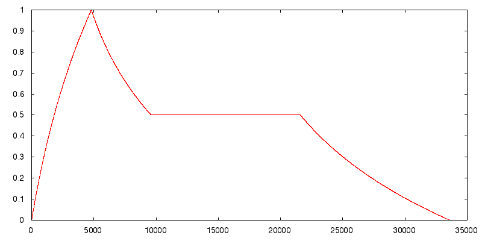

# libADSR 

##example.c
```c
#include <stdio.h>
#include <stdlib.h>
#include <math.h>
#include "adsr.h"

#define SAMPLING_RATE 48000
#define A_LENGTH 4800
#define D_LENGTH 4800
#define S_LENGTH 12000
#define R_LENGTH 12000
#define S_LEVEL 0.50
#define NUM_SAMPLES A_LENGTH + D_LENGTH + S_LENGTH + R_LENGTH

#define FREQ 1000

int main(void) {
  FILE *file = fopen("example.raw", "wb");

  for (int i = 0; i < NUM_SAMPLES; i++) { 
    float sample = sin(2 * M_PI * FREQ * i / SAMPLING_RATE);
    sample *= adsr_envelope(A_LENGTH, D_LENGTH, S_LENGTH, R_LENGTH, S_LEVEL, i);
    fwrite(&sample, sizeof(float), 1, file);
  }
  fclose(file);
}

//Creates a file (`example.raw`) containing a 1k sine tone with an ADSR envelope.
//You can play this back with SoX like this:
//play -c 1 -r 48000 -b 32 -e float -t raw example.raw
```
